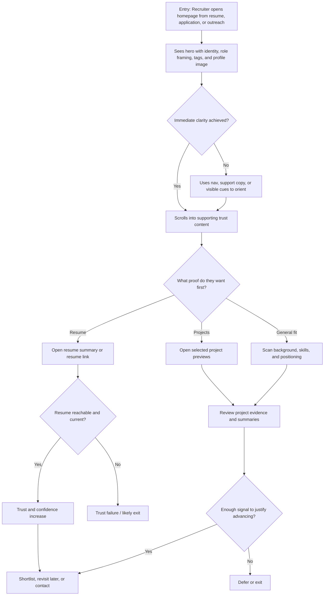
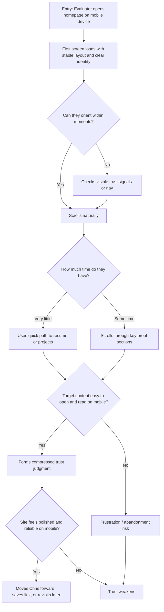
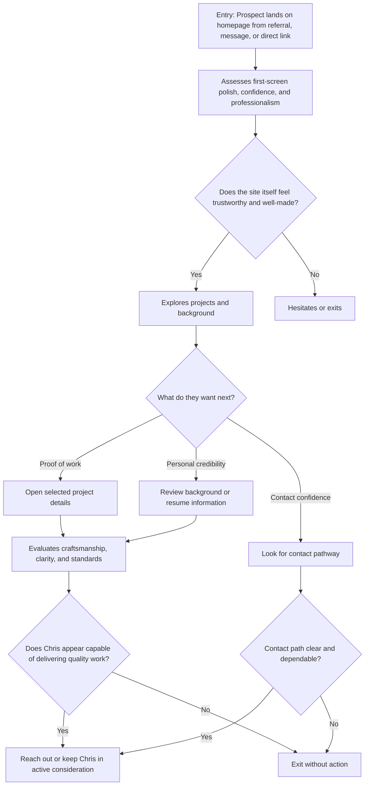

# UX Design Specification personal-website

**Author:** Chris
**Date:** 2026-03-09T09:34:03-07:00

---

<!-- UX design content will be appended sequentially through collaborative workflow steps -->

## Executive Summary

### Project Vision

`personal-website` is Chris's owned digital home base: a fast, carefully crafted personal website that unifies professional identity, proof of work, and future publishing into one coherent experience. From a UX perspective, its purpose is to create trust quickly and credibly by helping visitors understand who Chris is, what he is good at, and why he is worth contacting, hiring, or following. The experience should feel intentionally designed and self-authored, because the site itself is part of the evidence of taste, technical judgment, and execution quality.

### Target Users

The primary audience is recruiters and hiring managers who need to assess Chris quickly, often while scanning on mobile or comparing multiple candidates in a short period of time. A second primary audience is consulting prospects or professional evaluators who are looking for signals of credibility, clarity, and delivery capability. A third important user is Chris himself as the long-term owner-editor of the site, which means the experience must be supported by a maintainable content and design system that stays easy to update. Secondary audiences include peers, collaborators, and socially adjacent visitors who want a clearer sense of Chris as a person, builder, and professional.

### Key Design Challenges

The most important UX challenge is making the first impression do enough work quickly: users should understand Chris's identity, value, and relevance within seconds. Another challenge is sequencing personality, professionalism, and evidence so the site feels human and distinctive without weakening clarity or seriousness. The design must also support multiple depths of engagement, giving fast-scanning evaluators a strong skim path while rewarding deeper visitors with richer project context and narrative. Finally, the experience must achieve a high level of visual polish without sacrificing accessibility, responsiveness, performance, or long-term maintainability.

### Design Opportunities

The strongest opportunity is to make the site itself a proof-of-work artifact, where typography, layout, pacing, and interaction quality communicate craft before a visitor reads every word. There is also a meaningful opportunity to create a recruiter-friendly evaluation path that surfaces role clarity, selected projects, resume access, and contact actions with very low friction. A third opportunity is to build a durable UX foundation that supports future growth into richer projects, writing, and ongoing public signals without requiring the site to be redesigned from scratch. If executed well, the result can feel both editorial and personal: memorable enough to stand out, but structured enough to build trust immediately.

## Core User Experience

### Defining Experience

The core experience of `personal-website` is frictionless orientation through movement: users arrive, understand who Chris is, and move through the site by scrolling and navigating without hesitation, confusion, or interruption. This is not a product where the value comes from complex interaction patterns; the value comes from making exploration feel so stable and natural that the interface recedes into the background. A successful experience helps visitors gather the information they need about Chris quickly, whether they are skimming for fast evaluation or exploring more deeply across pages. In this context, navigation is not just a utility layer - it is the primary user experience system, because it determines whether visitors feel in control, confident, and willing to continue.

### Platform Strategy

The product is a browser-based experience for both desktop and mobile, with equal emphasis on reliability across mouse/keyboard and touch interaction models. Desktop users should benefit from crisp hierarchy, easy pointer interaction, and clear page structure, while mobile users should get the same confidence through stable scrolling, tap-friendly targets, and responsive layouts that preserve meaning rather than simply shrinking content. The platform should remain aligned with the static-first architecture already established in project research, minimizing runtime complexity in favor of speed, consistency, and resilience. No offline behavior or device-specific hardware features are required; the critical platform requirement is that core browsing behavior feels native, dependable, and free of surprises across modern browsers.

### Effortless Interactions

The most important effortless interactions are scrolling, moving between pages, viewing projects, and opening the resume. These actions should require no interpretation and no recovery effort: the site should feel predictable, visually stable, and easy to traverse. Navigation should support trust by preserving expected browser behavior, including reliable links and intuitive back-and-forward movement. Interactive states should never get stuck or feel visually broken after click, tap, or hover; every element should return cleanly to rest. The site should also avoid the common friction patterns that make personal websites feel adversarial or disposable, including popups, permission interruptions, cookie nags, newsletter traps, and decorative behavior that competes with content. A small moment of delight may come from allowing the circular profile photo to expand on demand, but only if it remains lightweight, optional, and secondary to the informational goals of the site.

### Critical Success Moments

The first critical success moment happens when a visitor lands on the homepage and orients themselves within seconds: they understand whose site this is, what Chris does, and where to go next. Another make-or-break moment occurs when a user moves from the homepage into high-value proof points such as the resume and projects pages without losing context or momentum. The experience feels successful when users can gather what they came for without needing to decode the interface, second-guess navigation, or recover from broken flows. The most damaging failures would be non-working links, intrusive popups, poor accessibility, unstable scrolling, unclear hierarchy, or page transitions and interaction states that feel jittery, sticky, or unreliable. Because this is a trust-building site, even small moments of friction can disproportionately weaken the overall impression.

### Experience Principles

- Treat navigation as the primary experience system, not a secondary interface layer
- Make orientation immediate so users understand identity, purpose, and next steps within seconds
- Preserve calm through predictable scrolling, reliable links, and stable interaction behavior
- Remove interruptions and friction so the content can do the work of building trust

## Desired Emotional Response

### Primary Emotional Goals

The primary emotional goal of `personal-website` is composed trust. Users should feel calm, confident, and immediately at ease, while also sensing that the experience reflects real care, taste, and competence. The site should not try to generate excitement through noise or spectacle; instead, it should create the impression that Chris is thoughtful, credible, and capable because every part of the experience feels intentional. A secondary emotional goal is quiet admiration: visitors should come away subtly impressed by the level of polish and restraint, feeling that the site is memorable because it is well made rather than because it is loud.

### Emotional Journey Mapping

On first arrival, users should feel oriented quickly and reassured that they are in the right place. The homepage should create an immediate emotional mix of clarity, calm, and trust, with no sense of overload or friction. During exploration, users should feel steadily in control as they scroll, navigate, and inspect content, with the interface reinforcing a sense of composure rather than demanding attention. After completing their task, whether that means understanding who Chris is, reviewing the resume, or exploring projects, they should feel informed, satisfied, and positively convinced of Chris's professionalism. If something goes wrong, the emotional goal should shift from delight to recovery: the experience should remain understandable and non-agitating rather than brittle or frustrating. On return visits, the site should feel familiar, dependable, and consistently well considered, strengthening trust over time.

### Micro-Emotions

The most important micro-emotions are confidence instead of confusion, trust instead of skepticism, ease instead of friction, and subtle delight instead of flat neutrality. Confidence matters because users should never need to second-guess what the interface is doing or where to go next. Trust matters because the site is part of how visitors judge Chris's professionalism and judgment. Ease matters because the site succeeds when information feels accessible without effort. Subtle delight matters because small moments of polish or refinement can make the experience feel more human and memorable, but only when they support rather than compete with clarity.

### Design Implications

To create composed trust, the design should prioritize stable layouts, strong hierarchy, clear wayfinding, and interaction behavior that always feels reliable and reversible. To support calm confidence, scrolling and navigation should feel smooth, predictable, and free of visual jitter or surprise. To support quiet admiration, craft should come through in typography, spacing, alignment, and motion restraint rather than decorative excess. Any optional delight should be brief, tasteful, and non-blocking, such as a refined image expansion or a polished transition that reinforces care without interrupting flow. Negative emotions should be prevented by eliminating intrusive patterns, broken links, sticky UI states, confusing navigation, accessibility failures, and any interaction that makes the user feel pushed, tricked, or overloaded.

### Emotional Design Principles

- Design for composed trust first, so every page feels calm, credible, and intentional
- Use clarity and reliability to create confidence before introducing any delight
- Let polish, restraint, and coherence create admiration rather than spectacle
- Protect the user from agitation by removing interruptions, confusion, and attention-seeking patterns

## UX Pattern Analysis & Inspiration

### Inspiring Products Analysis

Three products provide the most useful inspiration for `personal-website`: `LinkedIn`, `GitHub`, and `Instagram`. Each represents a distinct strength that maps well to the goals of the site. `LinkedIn` is valuable because it makes professional identity legible quickly; users can land on a profile, orient themselves, and scroll through experience and qualifications with relatively little ambiguity. `GitHub` is valuable because it supports depth of proof; users can move from a summary view into detailed project material and documentation when they want evidence. `Instagram` is useful because it lets people build an immediate sense of someone's personal expression and visual identity through a profile-centered browsing experience.

What makes these products worth studying is not their social or platform nature, but the clarity of the jobs they perform. `LinkedIn` helps users answer "Is this person professionally credible?" `GitHub` helps answer "What has this person actually built?" `Instagram` helps answer "What kind of person is this, and how do they express themselves?" Together, they cover the three major interpretation layers your site needs to support: professional trust, evidence of work, and human presence. The goal is not to mimic these products directly, but to extract the structural strengths that help visitors evaluate a person quickly and confidently.

### Transferable UX Patterns

Several patterns are especially transferable. From `LinkedIn`, the most useful pattern is profile-first orientation: visitors should understand immediately whose site this is, what kind of information is available, and where to scroll next. From `GitHub`, the most valuable pattern is evidence layering: users should be able to start with a concise project summary and then intentionally move into richer detail when they want proof. From `Instagram`, the most relevant pattern is identity-forward presence: the site should communicate something personal and distinctive quickly, without requiring long reading before the visitor gets a sense of who Chris is.

Across all three, the strongest shared pattern is progressive understanding. Users begin with a broad impression, then deepen only if interest is earned. That pattern aligns directly with your goals: allow fast professional evaluation, support deeper project exploration, and preserve a memorable sense of personality without forcing visitors into cluttered or overly complex flows. Reliable scrolling, clear hierarchy, and selective click-for-depth interactions are the most important behaviors to carry forward.

### Anti-Patterns to Avoid

These inspiration sources also reveal several anti-patterns to avoid. `LinkedIn` often becomes cluttered, module-heavy, and visually tiring, which weakens the calm confidence your site should create. `GitHub` can overwhelm visitors when technical detail appears before context, especially for users who are not deeply technical. `Instagram` can encourage superficiality, distraction, and endless-feed behavior that undermines composure and intentionality. For `personal-website`, the core anti-patterns to avoid are cluttered layouts, too many competing actions, social-style engagement loops, attention-hijacking elements, weak information hierarchy, and any interaction model that causes users to lose context or feel pushed through the experience rather than guided.

### Design Inspiration Strategy

The design strategy is to adopt each product's strongest structural quality while adapting it to the emotional and experiential goals of a calm, trust-building personal website. From `LinkedIn`, adopt fast profile legibility, but simplify it into a cleaner and less crowded information hierarchy. From `GitHub`, adopt depth-on-demand for projects, but present technical work in a way that remains inviting and understandable. From `Instagram`, adopt expressive personal presence, but ground it in restraint so personality supports credibility instead of overshadowing it.

In practice, this means designing a homepage that acts as a clear profile entry point, using scroll as the main mechanism for overview, and allowing deeper clicks into projects and resume content only when users want more detail. It also means being disciplined about what not to import: no feed logic, no engagement gimmicks, no cluttered side modules, and no pressure to mimic social platform conventions. The site should feel like a distilled, quieter, more intentional synthesis of these strengths - one that helps visitors understand Chris quickly, trust what they see, and continue exploring without friction.

## Design System Foundation

### 1.1 Design System Choice

`personal-website` will use a custom design system foundation. This choice does not mean inventing a large product-scale system or designing every screen from scratch with no reusable structure. It means establishing a deliberately small, tailored system of design tokens, layout primitives, and reusable interface patterns built specifically for the goals of this site. The system should feel self-authored and visually distinctive, while remaining disciplined enough to support consistency, accessibility, and long-term maintainability.

### Rationale for Selection

A custom design system is the strongest fit because the site itself is part of the message. Visitors are not only consuming information about Chris; they are also judging taste, judgment, and execution through the interface. An established or theme-heavy system would make it harder to achieve the quiet distinctiveness and composed trust the site is meant to communicate, especially if recognizable framework defaults remain visible. At the same time, a fully ad hoc approach would introduce too much inconsistency and maintenance risk. A lightweight custom system creates the right middle path: enough structure to keep the site coherent, enough flexibility to make it feel personal and memorable, and enough technical restraint to stay aligned with the static-first, low-complexity architecture defined in prior research.

### Implementation Approach

The implementation approach should follow a layered system model. First, define a small set of design tokens for typography, spacing, color roles, surfaces, borders, radii, and motion behavior. Second, establish layout primitives and structural patterns that determine how content is arranged across pages. Third, build a narrow set of reusable components based on actual site needs, such as navigation, links, buttons, project cards, resume blocks, image treatments, and section containers. Finally, compose pages from those reusable building blocks rather than styling each page independently. This approach keeps the system small, legible, and extensible while avoiding the overhead of a large UI framework.

### Customization Strategy

Customization should emphasize coherence, restraint, and repeated use of strong foundational rules rather than variety for its own sake. The system should express identity through typography, spacing rhythm, hierarchy, surface treatment, and interaction polish, not through an explosion of one-off components or decorative flourishes. Each customization decision should reinforce the site's emotional goals of calm, trust, clarity, and quiet admiration. Accessibility patterns and implementation lessons can still be borrowed from established systems where useful, but the final visual language should remain clearly self-authored. The guiding rule is to customize where it creates meaningful differentiation, and standardize where consistency improves usability and maintenance.

## 2. Core User Experience

### 2.1 Defining Experience

The defining experience of `personal-website` is immediate legibility with elegant motion. Users should arrive and, within seconds, feel that they are looking at a site that is modern, polished, and unusually respectful of their attention. They should understand who Chris is, recognize the site as thoughtfully made, and begin exploring almost automatically through scrolling. What makes the experience special is not a novel interaction model, but the rare combination of clarity, visual restraint, and subtle motion that makes exploration feel both calm and impressive.

If this defining experience works, users will feel the difference right away: no popups, no clutter, no hesitation, no need to decode the interface. Instead, the site will present information cleanly while using small amounts of responsive motion to make scrolling feel alive, intentional, and pleasurable. The result should be a sense of effortless discovery, where visitors absorb identity, qualifications, and proof of work through a page that feels fast, coherent, and carefully tuned.

### 2.2 User Mental Model

Users approach a personal website with a familiar goal: figure out who this person is, whether they seem credible, and where to find the most relevant supporting information. Recruiters and hiring managers usually want this fast and with minimal cognitive load. Other visitors may be more exploratory, but they still expect the site to behave predictably and help them build an accurate impression quickly. Their existing mental model is shaped by years of browsing sites that interrupt, distract, or bury useful content behind clutter, popups, weak hierarchy, or excessive self-promotion.

Because of that, users often arrive with low-grade skepticism. They expect modern websites to look polished, but they also expect polish to come with friction, performance cost, or attention-grabbing gimmicks. `personal-website` should fit their familiar model of landing, scanning, scrolling, and clicking into deeper content, while outperforming expectations by removing the common annoyances they have learned to tolerate. The site should feel like a better version of a pattern they already understand.

### 2.3 Success Criteria

The core experience succeeds when users can arrive and orient themselves almost instantly. Within the first moments, they should understand whose site they are on, what kind of work Chris does, and where they can go next for more detail. Scrolling should feel fluid and trustworthy, revealing content in a sequence that feels natural rather than arbitrary. If motion is used, it should make the interface feel refined and responsive without ever making users work harder to read, track, or navigate.

Users should feel successful because the site keeps them in flow. They never have to recover from interruptions, question where they are, or wait for decorative behavior to finish. Key proof points like the resume and projects should feel close at hand, and deeper exploration should feel like a continuation of the same calm experience rather than a mode switch. The strongest signal that "this just works" is that users notice the quality of the experience without having to think about how it works.

### 2.4 Novel UX Patterns

This experience is primarily built on established patterns: landing on a homepage, scrolling for overview, and clicking into deeper content. That is the right foundation because the site should not require explanation or user education. The novelty comes from execution quality and composition rather than from a fundamentally new UI model. Specifically, the site can differentiate itself through subtle scroll-responsive motion, clean sequencing of information, and an unusually disciplined absence of interruption.

Any more expressive interactions should behave as enhancements layered onto familiar patterns. Scroll-linked visual shifts, tasteful reveals, or subtle changes in emphasis can make the experience feel modern and finely crafted, but they should never become necessary for comprehension. The unique twist is therefore not "learn this new interaction," but "experience a familiar interaction done with more polish, care, and restraint than users expect."

### 2.5 Experience Mechanics

The experience begins the moment the page loads. Users should see a clear identity signal, a strong first-screen framing of who Chris is, and a visual presentation that feels both open and intentional. The page itself should invite scrolling through hierarchy, spacing, and tasteful motion cues rather than through aggressive prompts. As users move downward, content should reveal itself in a sequence that feels coherent and confidence-building, with each section adding depth without creating confusion.

The primary interaction is scrolling, supported by selective clicking into deeper content such as projects and resume material. Scroll behavior should remain stable and readable first, with any linked motion acting as a secondary enhancement that responds smoothly to user movement. Interactive elements should feel immediate and reliable, and any more expressive visual behavior should degrade gracefully when accessibility settings, device capability, or performance constraints require a simpler presentation. Feedback comes from composure: the user feels they are succeeding because the site keeps pace with them, never blocks them, and consistently turns movement into understanding. Completion happens when users have gathered the information they came for and leave with a stronger sense of Chris's credibility, capability, and care.

## Visual Design Foundation

### Color System

`personal-website` should use a warm, restrained color system built from the provided palette, with `#FFF4EA` as the primary background foundation. This light base should dominate the experience so the site feels open, calm, and easy to read. `#EDDCC6` should function as a supporting surface tone for section contrast, cards, subtle containers, borders, or tonal layering. `#BF4646` should serve as the primary emphasis color for selective highlights, key actions, or moments of visual focus. `#7EACB5` should act as a complementary accent, used sparingly to introduce balance, secondary emphasis, or supportive visual variation without competing with the primary emphasis role.

To keep the theme flexible, the color system should be implemented through semantic design tokens rather than hard-coded palette values. Raw brand colors should map into roles such as background, surface, text, border, primary accent, secondary accent, and interactive states, so the palette can be swapped later without redesigning the whole interface. The overall rule should be restraint: structure should come primarily from layout, typography, and spacing, while color is used to guide attention and create rhythm. This prevents the palette from becoming busy and helps the visual language remain calm, professional, and legible.

### Typography System

The typography system should feel polished, readable, and quietly distinctive. Because the site needs to communicate professionalism and personal authorship at the same time, the best fit is an editorial-style pairing: a refined serif or serif-leaning display face for major headings, paired with a clean sans-serif for body text, navigation, labels, and interface controls. This combination would give the site a stronger sense of taste and identity than a generic all-sans system, while still keeping reading easy across devices and content lengths.

The type hierarchy should create immediate structure through strong contrast between display headings, section headings, supporting headings, body copy, metadata, and small UI text. Body text should prioritize legibility with accessible sizing, generous line height, and sensible measure. Headings should provide visual character and pacing, but remain disciplined enough not to feel ornamental or old-fashioned. Typography should carry a large portion of the site's personality, allowing the interface to feel custom and intentional even when color and layout remain restrained.

### Spacing & Layout Foundation

The spacing and layout foundation should feel airy, confident, and editorial. An `8px` base spacing system is the strongest fit because it scales cleanly from fine interface details to large section rhythms. The layout should use whitespace as a core design tool, not just leftover room, helping the site feel calm, premium, and easy to scan. Content density should remain low to moderate so that important material such as identity statements, qualifications, and project previews has enough visual separation to be absorbed quickly.

The layout system should rely on a responsive grid with consistent page gutters, strong vertical rhythm, and clear content width constraints that preserve readability on both desktop and mobile. On larger screens, the site should feel composed and intentionally framed rather than stretched wide. On smaller screens, the hierarchy should remain obvious without becoming cramped. Spacing decisions should reinforce the emotional goals directly: more breathing room means less cognitive noise, better scanning, and a stronger sense of trust and control.

### Accessibility Considerations

Accessibility should be treated as a visual quality requirement, not a compliance afterthought. Because the palette includes soft warm tones, text and UI contrast need careful management so readability stays strong on `#FFF4EA` and `#EDDCC6` backgrounds. Brand accents should not carry primary reading responsibilities unless they pass contrast comfortably at their intended sizes. A darker neutral text color should do most of the heavy lifting for body content, while the accent colors remain focused on emphasis, interaction, and supporting structure.

Interactive states should be clearly distinguishable across hover, focus, active, and visited states, with visible focus indicators that do not rely on subtle color shifts alone. Typography should maintain accessible sizes, line lengths, and spacing at every breakpoint. Any scroll-linked motion or visual enhancement should respect reduced-motion preferences and degrade gracefully on less capable devices. The visual system should ultimately prove its quality through clarity, comfort, and control as much as through beauty.

## Design Direction Decision

### Design Directions Explored

The design exploration surfaced three directions as most relevant to `personal-website`. `01 Editorial Hero` delivered the strongest first impression through a bold header composition, immediate identity framing, and clear high-signal entry into the site. `06 Warm Magazine` introduced a more editorial, human, and expandable content structure that better supports the site's role as a long-term personal home rather than a narrowly optimized hiring page. `03 Narrative Scroll` contributed the most relevant interaction inspiration, showing how restrained scroll-led motion could add focus and polish without becoming theatrical or disruptive.

The key insight from exploration is that the final direction should not be an even blend of multiple concepts. It needs one dominant visual logic. For this project, that dominant logic should come from `Editorial Hero`, with selective structural borrowing from `Warm Magazine` and a carefully limited motion philosophy borrowed from `Narrative Scroll`. This keeps the experience coherent while still allowing it to feel more personal, expressive, and alive than a purely career-focused landing page.

### Chosen Direction

The chosen direction is `Editorial Hero` as the primary design foundation, refined by selective influences from `Warm Magazine` and `Narrative Scroll`. The hero should remain the defining first-screen moment: strong typography, immediate professional framing, and visible tags for skills and consulting availability. To make the opening feel more personal and visually complete, the hero should include a profile picture in the upper-right area of the layout. This portrait element should act as a humanizing counterweight to the strong textual structure, helping the site feel like a personal home rather than a generic professional profile.

Below the hero, the site should adopt a warmer editorial organization based on three launch priorities: `Projects`, `Resume`, and `Contact`. These should feel like clear, meaningful pathways for trust-building evaluation rather than generic homepage sections. Future writing or blog content should be accounted for in the long-term information architecture, but it should remain explicitly outside launch scope. `Photos` should be treated as a future-facing content area and accounted for in the long-term information architecture, but it should remain out of launch scope so the initial product stays focused.

Scroll-led motion should be used as a subtle enhancement layer, not as a defining gimmick. Motion may help bring sections into focus, create a sense of pace, or reinforce content transitions as users scroll, but it should never cause interactive elements to drift, slide away, or become harder to target. Buttons, links, and other controls must remain stable and predictable. The goal is motion that deepens attention and polish, not motion that competes with usability.

### Design Rationale

This direction works because it gives the site a strong first impression without trapping it in a purely recruiter-oriented frame. `Editorial Hero` best satisfies the need for instant clarity, credibility, and visual polish, which are essential for trust-building visitors who make judgments quickly. At the same time, its default composition can feel somewhat narrow if left alone. Borrowing the content organization sensibility of `Warm Magazine` broadens the site's identity, making space for projects, resume material, and a clear contact path to coexist as parts of one coherent personal platform at launch while preserving room for future writing later.

The motion strategy strengthens the experience only because it is constrained. `Narrative Scroll` is useful as a source of pacing and emphasis, but not as a full design model. By limiting motion to non-intrusive scroll-led focus effects and explicitly protecting control stability, the final direction preserves calm confidence, accessibility, and ease of use. This aligns directly with the product's core UX principle: users should feel impressed by the site without ever having to fight it.

### Implementation Approach

Implementation should begin with the hero composition as the primary design anchor. The first screen should combine a strong serif-led headline, concise supporting copy, visible skill and availability tags, and an upper-right portrait treatment that feels integrated rather than decorative. The homepage should then flow into three clearly organized launch sections or pathways: `Projects`, `Resume`, and `Contact`, with future writing positioned as a later expansion rather than a launch destination. These should be structured with enough warmth and editorial rhythm to feel inviting, but with enough hierarchy and discipline to preserve fast scanning.

Motion should be implemented progressively and conservatively. Scroll-linked effects should emphasize content transition, reveal, or focus without displacing interactive targets or reducing legibility. The safest implementation model is to animate supporting layers, imagery emphasis, opacity, or positional nuance within non-interactive content zones while keeping controls physically stable in the layout. All motion should respect reduced-motion settings, remain lightweight in performance terms, and be treated as enhancement rather than dependency. If the motion is removed, the design should still feel complete, polished, and easy to use.

## User Journey Flows

### Recruiter or Hiring Manager - Fast Trust Path

This journey supports the primary launch audience: a recruiter or hiring manager arriving from a resume, application, or outreach context. Their job is not to deeply explore for entertainment, but to make a confident evaluation quickly: Is Chris credible, qualified, and worth advancing? The experience must provide immediate role clarity, strong visual professionalism, fast access to proof, and very low friction between first impression and next-step judgment. Success happens when the visitor forms a strong enough trust signal within minutes to move Chris forward, save the site for later review, or return during later interview stages.

### Hiring Manager or Recruiter - Mobile / Time-Pressure Evaluation Path

This journey serves evaluators on small screens or under severe time pressure. They may only spend seconds on the site before deciding whether it is worth more attention. The design must compress trust formation into the smallest possible surface area: immediate identity clarity, stable scrolling, obvious next actions, and fast access to the highest-value proof points. Success happens when the site still feels premium, dependable, and easy to use on mobile, allowing the user to make a quick positive judgment without pinching, hunting, or deciphering the layout.

### Consulting Prospect - Trust and Capability Path

This journey supports a potential consulting client evaluating whether Chris has the judgment, quality bar, and delivery capability they would want for their own software or digital presence. Unlike recruiters, consulting prospects are often assessing both the content and the site itself as evidence. The experience must communicate craftsmanship, professionalism, and thoughtful decision-making while making projects, background, and contact pathways easy to reach. Success happens when the prospect concludes that Chris seems capable of producing work with the same level of care and polish that the site demonstrates.

### Journey Patterns

Across all three flows, the homepage functions as the universal trust gateway. Every high-value visitor starts by evaluating the first screen before committing to deeper exploration, so the hero must do more than introduce the site - it must reduce doubt quickly. A second shared pattern is proof escalation: users begin with broad impression and then move into increasingly specific trust assets such as resume, projects, background, or contact pathways depending on their intent. This means the interface should support selective deepening rather than forcing all users through one path.

The flows also share a strong need for stable interaction behavior. Scrolling must feel calm, link behavior must be reliable, and high-value destinations must remain easy to reach from any device. Users repeatedly ask quiet internal questions such as "Do I understand who this is?", "Does this feel credible?", and "Can I get the proof I need quickly?" The site should answer those questions through hierarchy, content placement, and composure rather than through explanatory UI or excessive prompts. Across journeys, recovery should be simple and reversible, but the highest-value strategy is prevention: avoid broken trust assets, muddy first impressions, and hard-to-find next steps.

### Flow Optimization Principles

The flow strategy should minimize time to trust by making the first screen carry as much signal as possible: identity, credibility, and directional clarity should all begin above the fold. Resume access, projects, and contact routes should always feel close at hand, especially for mobile and time-constrained visitors. Each journey should reduce cognitive load by presenting a small number of meaningful next moves rather than crowded choices or overly clever interaction patterns.

Moments of delight should come from refinement, pacing, and tasteful motion rather than extra steps or novelty. Scroll-led emphasis may help sections come into focus, but it should never slow decision-making, displace controls, or obscure key information. The most dangerous failure points across these flows are broken or outdated trust assets, weak mobile legibility, unclear contact paths, and motion or layout choices that make the site feel more performative than dependable. The guiding principle is simple: trust must always become easier to form than doubt.

## Component Strategy

### Design System Components

Because `personal-website` uses a lightweight custom design system rather than a packaged UI library, the default building blocks should remain primitives, not prebuilt application-style components. The foundation should consist of tokens for color, spacing, typography, borders, radii, surfaces, and motion, plus a small set of structural patterns such as containers, section wrappers, stacks, grids, text treatments, buttons, links, tags, cards, and image frames. These primitives should do most of the work across the site so the system stays coherent, flexible, and easy to maintain.

This means the component strategy should begin with a bias toward composition rather than invention. If a need can be handled by combining primitives consistently, it should not become a separate custom component. The real gaps are the site-specific patterns that carry trust, identity, and proof in ways that generic building blocks cannot fully express. Those are the areas where custom components are justified.

### Custom Components

### Hero Identity Panel

**Purpose:** Create the defining first-screen trust moment by combining identity, professional framing, skill tags, availability signal, portrait treatment, and initial navigation cues into one coherent composition.  
**Usage:** Homepage hero only.  
**Anatomy:** Primary headline, supporting copy, trust tags, primary actions or navigation links, upper-right portrait block, optional supporting metadata.  
**States:** Default, responsive rearrangement, reduced-motion mode.  
**Variants:** Desktop hero and mobile-compressed hero.  
**Accessibility:** Semantic heading structure, descriptive alt text for portrait, logical reading and tab order, no motion-dependent comprehension, strong contrast for all text and tags.  
**Content Guidelines:** Keep messaging concise, role-defining, and high-signal. Tags should remain sparse and meaningful.  
**Interaction Behavior:** Supporting visual layers may respond subtly to scroll, but text, tags, and controls remain stable and easy to target.

### Trust Tag Pattern

**Purpose:** Surface compact trust signals such as skills, focus areas, or consulting availability in a fast-scanning format.  
**Usage:** Hero and selected summary areas.  
**Anatomy:** Container, short label, optional tonal treatment, optional link behavior.  
**States:** Static, hover, focus, active if interactive.  
**Variants:** Informational tag, linked tag, compact mobile tag.  
**Accessibility:** Clear text labels, no color-only meaning, proper semantics when interactive, sufficient touch target sizing where clickable.  
**Content Guidelines:** Use sparingly and prioritize relevance over quantity.  
**Interaction Behavior:** Crisp, minimal state changes with no bounce or drift.

### Editorial Pathway Block

**Purpose:** Introduce major launch destinations - `Projects`, `Resume`, and `Contact` - as meaningful trust-building pathways rather than generic navigation tiles.  
**Usage:** Homepage transition from first impression into deeper exploration.  
**Anatomy:** Section label, short rationale or descriptor, optional visual accent or thumbnail, clear destination link.  
**States:** Default, hover/focus, responsive stacked layout.  
**Variants:** Standard pathway block and more prominent featured pathway block.  
**Accessibility:** Clear destination labels, large touch areas, readable supporting text, consistent heading hierarchy.  
**Content Guidelines:** Explain why each destination matters, not just where it goes.  
**Interaction Behavior:** May use subtle reveal-on-scroll emphasis, but structure and targets remain fixed.

### Project Proof Card

**Purpose:** Present selected work as concise evidence that encourages deeper review without overwhelming the visitor.  
**Usage:** Homepage featured projects and projects listing views.  
**Anatomy:** Project title, short summary, role or context line, optional image, explicit link to deeper detail.  
**States:** Default, hover/focus, image fallback state if needed.  
**Variants:** Featured proof card, compact proof card, text-forward proof card.  
**Accessibility:** Explicit link affordances, readable summaries at all breakpoints, images never required for comprehension.  
**Content Guidelines:** Emphasize proof, context, and outcomes over decorative language.  
**Interaction Behavior:** Mild emphasis shifts are acceptable; readability and click clarity come first.

### Resume Snapshot Block

**Purpose:** Provide immediate qualification signal and a dependable path into fuller resume content.  
**Usage:** Homepage and resume entry areas.  
**Anatomy:** Resume heading, concise qualification highlights, clear resume action or destination.  
**States:** Default, responsive condensed layout, hover/focus on links.  
**Variants:** Homepage snapshot and fuller resume entry panel.  
**Accessibility:** Strong heading structure, obvious link labeling, keyboard accessibility, clean mobile presentation.  
**Content Guidelines:** Put the most decision-relevant information first; avoid dense walls of text.  
**Interaction Behavior:** Straightforward and highly stable, with no decorative animation dependency.

### Contact Confidence Block

**Purpose:** Help recruiters and consulting prospects take action with minimal hesitation.  
**Usage:** Contact section, homepage footer, or end-of-flow trust area.  
**Anatomy:** Invitation text, preferred contact method, optional secondary links, reassurance copy if useful.  
**States:** Default, hover/focus, future success/error states if richer contact interactions are added later.  
**Variants:** Launch-simple link-based version, future expanded contact module.  
**Accessibility:** Clear labels, distinct interaction states, no hidden actions or ambiguous affordances.  
**Content Guidelines:** Keep tone direct, warm, and confident rather than promotional.  
**Interaction Behavior:** No flourish needed; this component should feel especially dependable.

### Component Implementation Strategy

The implementation strategy should stay primitive-first, composition-first, and token-driven. Most UI should be assembled from consistent foundational building blocks, with custom components introduced only where the site needs a distinctive trust pattern, editorial structure, or proof presentation that primitives alone would not communicate effectively. This keeps the system narrow and maintainable while preserving the authored feel established in earlier steps.

Custom components should map directly to critical journeys rather than to abstract design ambition. The `Hero Identity Panel` supports the first-screen trust gateway. The `Trust Tag Pattern`, `Resume Snapshot Block`, and `Project Proof Card` support rapid proof escalation. The `Editorial Pathway Block` supports movement into the three launch content areas. The `Contact Confidence Block` supports the final trust-to-action step. Motion should be implemented as a restrained behavioral layer within these components where appropriate, not as a standalone component family.

### Implementation Roadmap

**Phase 1 - Core Trust Layer:** Build the primitive foundation first, then implement the `Hero Identity Panel`, `Trust Tag Pattern`, primary navigation, and `Resume Snapshot Block`. These support the fastest trust-forming paths and the most critical launch flows.

**Phase 2 - Proof and Pathway Layer:** Build the `Editorial Pathway Block` and `Project Proof Card` next. These define how users move from first impression into deeper evidence and longer-form exploration.

**Phase 3 - Action and Enhancement Layer:** Build the `Contact Confidence Block` and then add restrained motion behaviors only after the static interaction model already works cleanly. Motion should be treated as polish, not infrastructure.

This roadmap keeps the system focused on launch value: establish trust first, reveal proof second, and add enhancement only after the fundamentals are already strong.

## UX Consistency Patterns

### Button Hierarchy

`personal-website` should use a restrained action hierarchy where visual emphasis is scarce and meaningful. Primary actions should only appear when there is a single most important next step in context, such as viewing the resume, opening a key project, or contacting Chris. Secondary actions should support exploration without competing for dominance, and tertiary actions should usually appear as text links or minimally styled controls. The interface should avoid presenting multiple primary buttons side by side unless there is a compelling reason, because equal-weight actions weaken clarity and make the experience feel more like a marketing page than a composed personal site.

Primary buttons should use the most decisive emphasis treatment in the system, likely tied to the primary accent role, while secondary buttons should rely on softer outlines, surface treatments, or quieter contrast. Button behavior should feel immediate, stable, and calm. Hover, focus, and active states should confirm interactivity without adding flourish, and controls must never shift size, move position, or animate in ways that make them harder to target. On mobile, all tap targets should remain comfortably large and separated enough to prevent accidental activation.

### Feedback Patterns

Feedback should follow a principle of immediate clarity with minimal disruption. Most interactions on this site are lightweight - following links, navigating between pages, opening deeper proof, or submitting a simple contact action - so feedback should usually be local, subtle, and proportional. Success, error, warning, and informational states should be visually distinct, but the default pattern should be inline confirmation rather than banners, alerts, or blocking interruptions. The site should feel responsive and understandable without sounding alarmist or over-explaining itself.

Success feedback should be concise and reassuring. Error feedback should be specific, calm, and recovery-oriented, telling users what went wrong and what to do next in plain language. Warning states should be rare and only used when a meaningful consequence exists. Informational messages should clarify state or expectation without slowing the user down. Across all feedback, color should never be the only signal; meaning should also come through text, iconography, placement, or structural emphasis. If a piece of feedback does not materially help the user recover, orient, or proceed, it should probably not appear.

### Form Patterns

Forms should be minimal, transparent, and easy to complete in one pass. For launch, the most important form-related need is likely a lightweight contact interaction, so the pattern should prioritize low friction over completeness. Inputs should have persistent visible labels, clear focus states, comfortable spacing, and straightforward field lengths. The form should ask only for information that directly supports the intended follow-up, avoiding any fields that feel bureaucratic, promotional, or unnecessarily invasive.

Validation should support completion rather than policing. Required fields should be obvious before submission, and errors should appear close to the relevant field with plain-language instructions for how to fix them. If inline validation is used, it should not trigger aggressively while users are still composing input. Submission states should make system status obvious: idle, in progress, success, or error. Keyboard navigation should work cleanly across all fields, labels and errors should be properly associated for assistive technology, and the full form should remain easy to use on narrow mobile screens without zoom frustration or cramped spacing.

### Navigation Patterns

Navigation should be one of the most stable and trustworthy systems in the product. Labels should be direct, familiar, and descriptive rather than branded or clever, with primary emphasis on the launch destinations that matter most: `Projects`, `Resume`, and `Contact`. Global navigation should make it easy to understand where to go next and how to return home, while local page structure should support continued scanning without disorientation. The system should never make users guess whether something is a link, where a destination leads, or how to retrace their path.

Current-page indication should be clear but understated. On desktop, navigation should be easy to scan at a glance and remain consistent across pages. On mobile, it should collapse into a predictable pattern that preserves access without obscuring content or introducing awkward gestures. Back/forward browser behavior must remain dependable, and links should behave like links. Any scroll-responsive visual treatment around navigation should affect only supporting presentation layers; navigation controls themselves must remain stable in purpose, placement, and target size.

### Additional Patterns

#### Modal and Overlay Patterns

Overlays should be treated as exceptions, not defaults. Because one of the product’s explicit UX goals is to avoid adversarial web behavior, modals must never be used for newsletter capture, cookie harassment, self-promotion, or generic interruption. If an overlay exists, it should serve a clear user benefit that would be genuinely harder to accomplish inline. It should open intentionally, close easily, preserve orientation, and feel lighter than the page around it rather than more dominant.

The clearest launch candidate for an overlay-like pattern is the optional profile-image expansion interaction. If implemented, it should behave like a simple image viewer with obvious close controls, escape-key support, focus management, and a clean return to the underlying page state. Overlays should not trap focus longer than necessary, obscure how to exit, or behave like full-screen takeovers unless content truly requires that treatment. If a need can be handled inline without confusion, inline should win.

#### Empty and Loading States

Empty and loading states should reinforce trust by making absence and waiting feel intentional, not broken. Empty states should explain what is unavailable in concise, calm language and, when useful, suggest a sensible next action. They should preserve layout quality and avoid sounding apologetic, robotic, or vague. A missing piece of content should still feel like part of a designed experience, not like a failed render.

Loading states should prioritize stability over theatrics. When structure is known, skeletons or quiet placeholders are preferable to noisy spinners because they preserve layout continuity and reduce perceived waiting. Loading indicators should match the product’s calm tone and should never dominate the screen. The most important rule is that content loading should not cause large jumps, collapsing regions, or visual instability that interrupts scrolling or weakens user confidence.

### Design System Integration

These patterns should be implemented through the custom design system primitives and focused custom components already defined in earlier steps. Button hierarchy should map to a small number of tokenized emphasis levels. Feedback and form states should reuse the same typography, spacing, border, and color logic as the rest of the interface. Navigation should inherit the site’s structural rhythm and interaction rules. Modal, empty, and loading behaviors should be treated as pattern-level constraints layered onto existing components rather than as separate design universes.

To preserve consistency, the site should follow a few high-level pattern rules. Prefer inline clarity over interruption. Let spacing and hierarchy do more work than decoration. Keep interactive targets stable in position and meaning. Use motion only when it improves focus or pacing, never when it competes with comprehension. Make recovery from errors or uncertainty feel straightforward and low-pressure. These rules keep the UX aligned with the broader experience goals: calm confidence, composed trust, and polished ease.

## Responsive Design & Accessibility

### Responsive Strategy

`personal-website` should use a mobile-first responsive strategy because mobile and time-constrained evaluation are core product realities, not edge cases. The mobile experience must preserve the same trust-forming qualities as desktop: immediate identity clarity, strong first-screen professionalism, stable scrolling, obvious navigation, and fast access to `Projects`, `Resume`, and contact pathways. Mobile should not be treated as a reduced afterthought or a compressed desktop layout; it should be treated as a primary expression of the product where the most important signals appear early and cleanly.

Desktop should use extra screen real estate to increase compositional strength, not content density for its own sake. Larger screens can support a more editorial hero composition, broader spacing, stronger visual rhythm, and selective multi-column layouts, but they should still preserve fast scanning and calm control. Tablet should act as a touch-first bridge between mobile and desktop, with moderate information density, simplified multi-column arrangements where appropriate, and interactions that work comfortably without hover assumptions. Across all device types, the responsive goal is not simply “fit the layout,” but preserve trust, readability, and orientation at every size.

### Breakpoint Strategy

The site should use a mobile-first breakpoint approach with standard baseline ranges, but rely on fluid design behavior wherever possible so the experience does not feel overly breakpoint-driven. A practical structure is:
- Mobile: `320px` to `767px`
- Tablet: `768px` to `1023px`
- Desktop: `1024px` and above

These breakpoints should trigger only meaningful layout changes. Typography, spacing, and content width should scale progressively using relative units and responsive constraints, while structural shifts should happen when they improve comprehension rather than when a device category changes in name only. For example, the hero should stack cleanly on mobile, transition into a more balanced split at tablet widths, and adopt its full editorial composition on desktop. Pathway blocks, project proof cards, and resume summaries should move from single-column to multi-column only when the added width clearly improves scanability. The system should favor a small number of intentional transitions over many micro-breakpoints.

### Accessibility Strategy

`personal-website` should target WCAG `2.2 AA` compliance as a non-negotiable baseline. This is the right level because accessibility is inseparable from the product’s trust goals: if the site is beautiful but hard to read, difficult to navigate by keyboard, incompatible with assistive technology, or uncomfortable for motion-sensitive users, it fails the product brief as much as it fails accessibility expectations. Accessibility should therefore be treated as product quality, not as a compliance layer added later.

The most important accessibility requirements are specific to this site’s risks and design choices. The warm background palette means text and interface contrast must be managed carefully with dark neutral text and clearly differentiated interactive states. Keyboard users must be able to reach all navigation, links, buttons, and overlays predictably, with visible focus indicators throughout. Screen-reader users should encounter a meaningful heading structure, descriptive links, clear landmarks, and sensible image alt text. Touch targets should meet or exceed `44x44px`. Scroll-linked motion and visual refinement must respect reduced-motion preferences and remain fully nonessential to comprehension. If the optional portrait overlay is implemented, it must support escape dismissal, proper focus management, and clean return to the invoking element.

### Testing Strategy

Responsive testing should focus on the contexts most likely to affect trust. That means testing on real phones and tablets, not just browser resizing, with special attention to mobile Safari, Chrome on Android, and mid-range devices where performance or browser UI behavior may expose layout weaknesses. Testing should verify that the first screen remains legible, stable, and persuasive across devices, that scrolling feels smooth and non-jittery, and that navigation and proof pathways remain obvious even under time pressure or poor network conditions.

Accessibility testing should combine automated tooling with manual validation. Automated checks should cover contrast, missing labels, semantic structure, and obvious violations. Manual testing should cover keyboard-only navigation, visible focus flow, VoiceOver and/or NVDA reading order, reduced-motion behavior, zoomed-text scenarios, and interaction with overlays or dynamic states. The highest-value test question is not just whether the site passes checklists, but whether it remains calm, understandable, and credible when accessed through different devices, browsing modes, or assistive technologies.

### Implementation Guidelines

Responsive implementation should use relative units such as `rem`, percentages, `clamp()`, and fluid width constraints instead of relying heavily on fixed pixel dimensions. Media queries should follow a mobile-first structure, and layout changes should be tied to content behavior rather than ornamental redesign. Images should be responsive and optimized by size, typography should scale intentionally, and spacing should preserve the site’s editorial openness at every breakpoint. Hover-only interaction patterns should never carry essential meaning, and mobile layouts should always surface the most important trust signals early.

Accessibility implementation should begin with semantic HTML and preserve native behavior wherever possible. Landmarks, headings, links, lists, buttons, and form controls should use native elements first, with ARIA added only where it truly clarifies behavior. Focus indicators should be clearly visible and consistent with the design system. Error messages, status changes, and overlays should announce themselves properly to assistive technologies when relevant. Skip links, reduced-motion support, disciplined alt text, proper heading order, and stable navigation behavior should all be treated as baseline requirements. Most importantly, the site should never depend on motion, color nuance, or layout complexity to communicate something essential.
